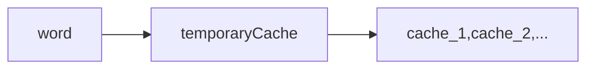

# 使用说明

[FingerMemory](https://github.com/nobility-zhang/FingerMemory)是基于node编写的一款快捷的手指记忆工具:alarm_clock:

## 编写此类程序初衷

大多数人都遇到过以下情况，在完全没有代码提示的情况下，会忘记某些单词的拼写，在查阅中往往会浪费很多时间，此时单词的拼写显得尤为重要

有很多记忆单词的软件，如anki、quizlet等，但是他都不怎么适合我，why？

- 有些人背诵时，用笔在纸上写
- 有些人背诵时，大声朗读出来
- 有些人背诵时，心里默默的读

我不属于这其中的任何一类人，我喜欢在背诵的时后使用键盘敲击，这样anki类的卡片记忆就无法满足，因为它们支支持那种卡片的记忆模式，对于coder来讲，手指记忆哪些没有任何逻辑的单词，比脑子记住要简单些

## 使用步骤

1. 你的电脑必须先安装node

2. 执行`git clone https://github.com/nobility-zhang/FingerMemory.git`

3. 对config.js进行简单的配置即可运行，打开配置文件会有注释说明

4. 根据配置文件导入你要背诵的单词，请按照以下顺序进行排序，分隔符默认为tab

   1. `word	单词	[帮助信息...]`

5. ```powershell
   cd FingerMemory/
   node app.js
   ```

## 特点

虽然[FingerMemory](https://github.com/nobility-zhang/FingerMemory)是一个cli的工具，但是功能也很强大

- 支持对导入单词表进行自定义分组个数
- 支持不正常退出后记忆退出的进度
- 有较美观的输出
- 内置四种模式选择
  1. 背诵模式
     1. 显示单词和词义，进行敲击背诵
     2. 输入错误会直接重新提问
  2. 顺序提问模式
     1. 显示单词，输入其含义
     2. `?`弹出提示
  3. 随机提问模式
     1. 随机的生成单词测试题，进行测试
     2. 有此次分数统计功能
  4. 单词卡模式
     1. `?`代表忘记，后续会继续输出
     2. 可以输入任意字符背诵，后续会继续输出
     3. 直接按enter键代表已经掌握，将此单词直接跳过

## 实现思想



这样生成cache文件，就算单词文件丢失也可以继续记忆

## 后续

由于cli工具界面没有web界面那么美观，会继续进行单机的web版本开发

